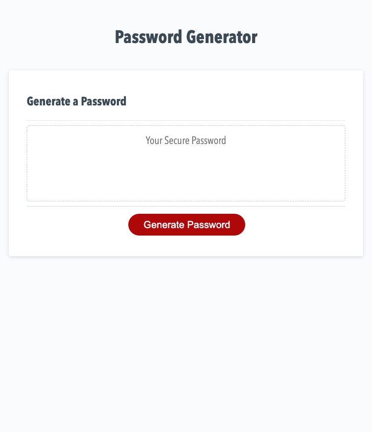

# RandomPasswordGen_NSC

## Description

This application is aimed to help companies with access to sensitive data create a unique password that provides extreme security. This application generates a secure random password based on user-input criteria. It functions by the user clicking the "Generate Password" button which then prompts the user to decide on the following criteria:

* Desired length of the password using a minimum of 8 characters a maximum of 128 characters.

Requiring the user to select at least one of the following:

* Does the user want the new password to contain lowercase characters?
* Does the new password contain uppercase characters?
* Does the new password contain number numeric characters?
* Does the new password contain special characters?

Once the program has verified that the password meets the minimum and maximum length requirements, it will generate a secure password using the criteria the user has selected. The new password is then displayed in the text area on the page for the user to copy down and save.

## Tech/Framework Used

Built with

•VS Code

## Installation

https://nsc9605.github.io/RandomPasswordGen_NSC/

## Demo Screenshot

## Credits

Tutorials followed:

[JavaScript Password Generator](https://www.youtube.com/watch?v=duNmhKgtcsI)

## License

MIT © 2020 Nicole Catapano
